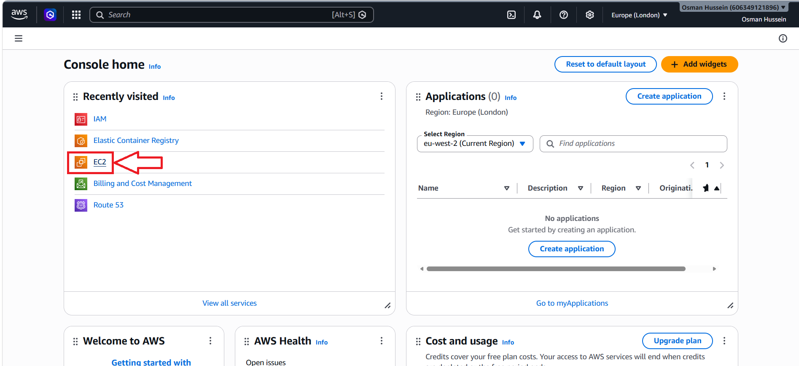
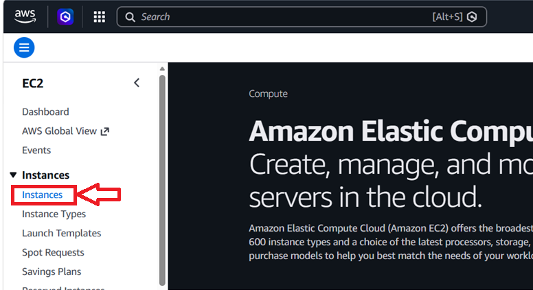
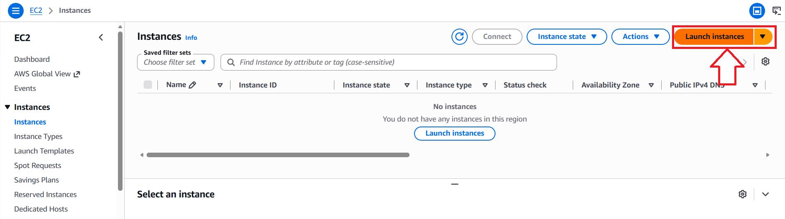

# EC2 Web Server Deployment

## Overview

This section demonstrates how to launch an Amazon EC2 instance, configure networking, security settings, and deploying a simple web server using EC2 User Data. It provides an introduction to creating cloud-based virtual servers and making applications accessible over the internet.

The deployment process introduces core AWS concepts such as EC2 instances, Security Groups, public IP addresses, and SSH access. These concepts form an important foundation for cloud infrastructure, automation, and modern DevOps practices.

## Contents

* [Navigating to EC2](#navigating-to-ec2)
* [EC2 Web Server Demo](#ec2-web-server-demo)
* [Key Takeaways](#key-takeaways)
* [Reflection](#reflection)

---

## Navigating to EC2

### Step 1: Navigate to EC2

From the AWS Console homepage, select **EC2** from the services list.

<p align="center">
  
</p>

---

### Step 2: Open Instances

Within the EC2 dashboard, navigate to:

**Instances → Instances**

<p align="center">
  
</p>

---

### Step 3: Launch an Instance

Select **Launch Instances** to begin creating a new EC2 instance.

<p align="center">
  
</p>

---

## EC2 Web Server Demo

https://github.com/user-attachments/assets/dfad2b5e-4ef2-47a4-b3f9-1e4e357ffe25

This walkthrough covers:

* Creating an EC2 instance
* Selecting an Amazon Linux AMI
* Creating an SSH key pair
* Configuring Security Groups
* Using EC2 User Data
* Installing a web server automatically
* Accessing the application through a browser
* Starting, stopping, and managing instances

---

## Key Takeaways

* EC2 instances can be launched in minutes using the AWS Console
* Security Groups control access to the instance
* EC2 User Data can automate software installation and configuration
* Opening port **80 (HTTP)** is required for web traffic
* Access the website using:

```text
http://<public-ip>
```

* Using the **Open Address** option may attempt HTTPS and fail if HTTPS has not been configured
* HTTP and HTTPS are different protocols and use different ports
* Stopping and starting an instance usually assigns a new public IP address
* EC2 combines compute, networking, storage, and security into a single service

---

## Reflection

This demo provided hands-on experience with launching and managing EC2 instances while demonstrating how web applications can be deployed in the cloud. It also reinforced the importance of Security Groups, public IP addresses, and EC2 User Data when deploying and accessing services on AWS.
