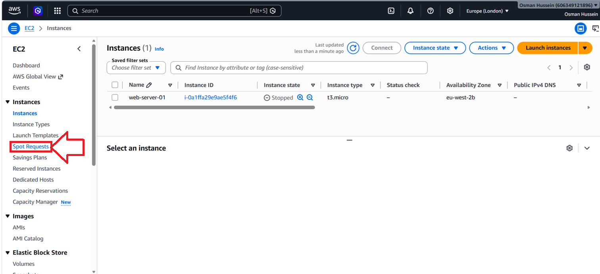
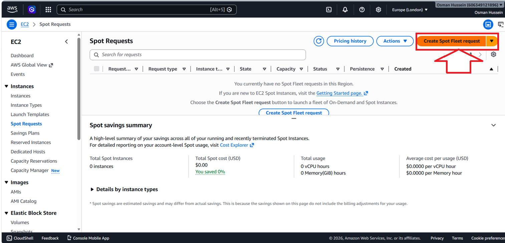

# EC2 Purchasing Options

## Overview

This section introduces the different purchasing options available for Amazon EC2 instances. AWS provides multiple pricing models designed to support different workload patterns, business requirements, and budgets.

Understanding these purchasing options is important because selecting the appropriate model can significantly reduce infrastructure costs while ensuring applications have the capacity and availability they require.

## Contents

* [On-Demand Instances](#on-demand-instances)
* [Reserved Instances](#reserved-instances)
* [Savings Plans](#savings-plans)
* [Spot Instances](#spot-instances)
* [Dedicated Hosts](#dedicated-hosts)
* [Dedicated Instances](#dedicated-instances)
* [Capacity Reservations](#capacity-reservations)
* [AWS Console Walkthrough](#aws-console-walkthrough)

---

### On-Demand Instances

On-Demand Instances provide the highest level of flexibility.

With On-Demand pricing:

* No long-term commitment is required
* Pay only for what you use
* Billed per second for most instance types

These instances are ideal for:

* Testing environments
* Development workloads
* Temporary projects
* Unpredictable workloads

> [!NOTE]
> On-Demand Instances offer flexibility but are typically the most expensive option for long-running workloads.

---

### Reserved Instances

Reserved Instances provide discounted pricing in exchange for a commitment period.

Available terms:

* 1 Year
* 3 Years

The longer the commitment, the greater the potential savings.

#### Standard Reserved Instances

Designed for workloads with predictable long-term usage.

Provides the highest discounts but less flexibility.

#### Convertible Reserved Instances

Allows instance attributes to be modified over time.

Provides additional flexibility while still offering cost savings.

Common use cases include:

* Production applications
* Long-running services
* Stable workloads

---

### Savings Plans

Savings Plans provide discounted pricing based on a commitment to a specific amount of compute usage.

Available terms:

* 1 Year
* 3 Years

Benefits include:

* Greater flexibility than Reserved Instances
* Discounts across multiple instance types
* Discounts across multiple AWS Regions

Savings Plans are often preferred for organisations that require flexibility while still benefiting from long-term savings.

> [!IMPORTANT]
> Savings Plans are commonly considered the recommended long-term cost optimisation option because they provide significant flexibility compared to Reserved Instances.

---

### Spot Instances

Spot Instances allow users to utilise unused AWS capacity at heavily discounted prices.

Benefits include:

* Significant cost savings
* Suitable for large-scale workloads

Limitations include:

* AWS can terminate the instance with little notice
* Capacity is not guaranteed

Common use cases include:

* Batch processing
* Data analysis
* Testing environments
* Fault-tolerant applications

> [!NOTE]
> Spot Instances should only be used for workloads that can tolerate interruptions.

---

### Dedicated Hosts

Dedicated Hosts provide an entire physical server exclusively for your organisation.

Benefits include:

* Full visibility into the physical host
* Greater control over hardware placement
* Support for licensing requirements

Common use cases include:

* Regulatory compliance
* Software licensing constraints
* Dedicated hardware requirements

---

### Dedicated Instances

Dedicated Instances provide isolated hardware that is not shared with other AWS customers.

Unlike Dedicated Hosts:

* Hardware is dedicated
* Physical server control is not provided

These instances are useful when isolation requirements exist without needing host-level visibility.

---

### Capacity Reservations

Capacity Reservations guarantee EC2 capacity within a specific Availability Zone.

Benefits include:

* Capacity availability guarantees
* Protection during high-demand periods
* Improved reliability for critical workloads

Common use cases include:

* Business-critical applications
* Disaster recovery environments
* High-priority workloads

> [!IMPORTANT]
> Capacity Reservations do not provide discounts. Their purpose is guaranteeing capacity availability.

---

## AWS Console Walkthrough

This demo explores where EC2 purchasing options can be viewed and configured within the AWS Management Console. AWS provides several purchasing models that help organisations optimise costs while maintaining flexibility and availability.

The walkthrough demonstrates how Spot Requests, Reserved Instances, Savings Plans, Dedicated Hosts, Capacity Reservations, and EC2 Instance Types can be accessed directly through the EC2 Console.

### Step 1: Navigate to Spot Requests

From the EC2 dashboard, select **Spot Requests** from the left-hand navigation menu.

  

---

### Step 2: Create a Spot Fleet Request

Select **Create Spot Fleet Request** to configure Spot capacity requirements, networking settings, instance types, and allocation strategies.

  

---

### Demo Video

The following walkthrough demonstrates how EC2 purchasing options can be explored through the AWS Console, including Spot Requests, Reserved Instances, Savings Plans, Dedicated Hosts, Capacity Reservations, and EC2 Instance Types.

https://github.com/user-attachments/assets/2f24f473-5731-4b0f-a0eb-1a57140132a1

---

## Key Takeaways

* AWS provides multiple EC2 purchasing models for different workload requirements
* On-Demand Instances offer maximum flexibility
* Reserved Instances provide discounts for long-term commitments
* Savings Plans combine cost savings with flexibility
* Spot Instances offer the lowest costs but can be interrupted
* Dedicated Hosts provide exclusive access to physical hardware
* Dedicated Instances provide isolated infrastructure
* Capacity Reservations guarantee EC2 capacity within a specific Availability Zone
* Purchasing options can be viewed and configured directly through the AWS Console
* Selecting the correct purchasing option can significantly reduce infrastructure costs

---

## Reflection

Learning about EC2 purchasing options helped me understand that cloud cost optimisation is not only about selecting the right instance type, but also choosing the most appropriate pricing model for a workload.

I also learned how AWS exposes these purchasing models through the EC2 Console, allowing engineers to compare options, manage capacity, and balance flexibility, availability, and cost based on application requirements.
