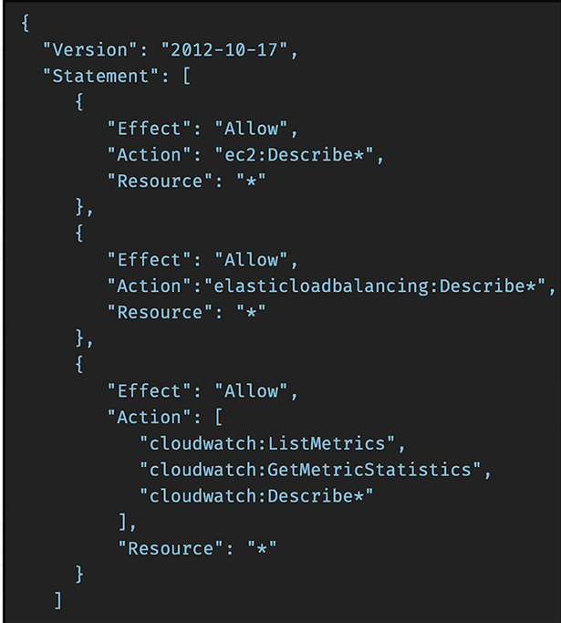

# IAM: Permissions

## Overview

This section introduces **IAM Permissions**, the mechanism used to control what users, groups, and roles are allowed to do within AWS. It focuses on how permissions are assigned through policies and how AWS evaluates access requests against those permissions.

Understanding IAM permissions is essential for securing AWS environments, as they determine which actions can be performed on specific resources while helping organisations enforce security and access control best practices.

## Contents

* [What Are IAM Permissions?](#what-are-iam-permissions)
* [IAM Policies](#iam-policies)
* [Actions and Resources](#actions-and-resources)
* [Principle of Least Privilege](#principle-of-least-privilege)

---

## What Are IAM Permissions?

IAM permissions define what actions a user, group, or role can perform within AWS.

Permissions determine access to AWS resources and control whether specific actions are allowed or denied.

Examples include:

* Launching EC2 Instances
* Creating S3 Buckets
* Viewing CloudWatch Metrics
* Managing IAM Users
* Deleting AWS Resources

Without permissions, AWS identities cannot interact with AWS services.

> [!NOTE]
> Permissions are not assigned directly through IAM itself. They are granted through IAM Policies.

---

## IAM Policies

IAM Policies are JSON documents that define permissions within AWS.

Policies act as a rulebook that tells AWS:

* Which actions are allowed
* Which actions are denied
* Which resources can be accessed

Policies can be attached to:

* Users
* Groups
* Roles

This allows administrators to control access centrally and consistently across AWS environments.

  

The example policy above allows read-only actions against several AWS services, including:

* EC2 instance information
* Elastic Load Balancer information
* CloudWatch metrics and statistics

Each policy statement contains:

* **Effect** – Whether the action is allowed or denied
* **Action** – The AWS API operations being controlled
* **Resource** – The AWS resources the permissions apply to

> [!NOTE]
> IAM policies are written in JSON and provide granular control over access to AWS resources.

---

## Actions and Resources

Permissions are built using actions and resources.

An action represents an operation that can be performed.

Examples include:

* ec2:DescribeInstances
* s3:ListBucket
* s3:GetObject
* cloudwatch:ListMetrics

Resources define which AWS resources those actions apply to.

For example, a policy may allow a user to view EC2 instances but prevent them from creating or deleting them.

This level of granularity provides precise control over AWS access.

---

## Principle of Least Privilege

AWS recommends following the **Principle of Least Privilege**.

This means granting only the permissions required for a user, group, or service to perform its job.

For example:

* A user who only needs to view data should receive read-only access.
* A developer should only receive permissions required for development tasks.
* Administrative access should be limited to authorised personnel.

Applying least privilege helps:

* Reduce security risks
* Prevent accidental changes
* Limit the impact of compromised accounts
* Improve overall cloud security

> [!IMPORTANT]
> Always grant the minimum permissions required and avoid assigning excessive access rights.

---

## Key Takeaways

* IAM permissions control what actions identities can perform in AWS
* Permissions are granted through IAM Policies
* Policies are written using JSON documents
* Policies can be attached to users, groups, and roles
* Permissions are based on actions and resources
* AWS follows an allow and deny model for access control
* The Principle of Least Privilege is a core AWS security practice
* Limiting permissions reduces security risks and operational mistakes

---

## Reflection

Learning about IAM permissions helped me understand how AWS controls access to resources across an environment. Rather than giving users unrestricted access, permissions can be carefully defined to allow only the actions required for specific tasks.

I also learned how policies provide granular control over AWS resources and why the Principle of Least Privilege is considered a security best practice. This reinforces the importance of access management when building secure and scalable cloud environments.
