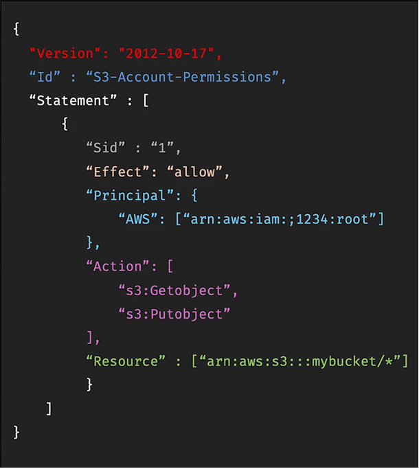

# IAM Policies

## Overview

This section introduces **IAM Policies**, the JSON documents used by AWS to define permissions and control access to resources. It focuses on understanding the structure of a policy and how AWS evaluates permissions through policy statements.

Learning how IAM policies are structured is important because they form the foundation of AWS authorisation. Policies determine who can access resources, what actions they can perform, and under which conditions those permissions apply.

## Contents

* [What Are IAM Policies?](#what-are-iam-policies)
* [IAM Policy Structure](#iam-policy-structure)
* [Understanding Policy Elements](#understanding-policy-elements)
* [Optional Policy Components](#optional-policy-components)

---

## What Are IAM Policies?

IAM Policies are JSON documents that define permissions within AWS.

They determine:

* Who can access AWS resources
* What actions can be performed
* Which resources can be accessed
* Whether access is allowed or denied

Policies can be attached to:

* Users
* Groups
* Roles

AWS also provides many pre-built managed policies, reducing the need to create policies from scratch.

> [!NOTE]
> IAM policies provide fine-grained control over AWS resources and are the primary mechanism used to manage permissions.

---

## IAM Policy Structure

A typical IAM policy consists of several key components that work together to define access permissions.

  

The example above demonstrates the common structure used throughout AWS IAM policies.

---

## Understanding Policy Elements

The main components of an IAM policy include:

### Version

Specifies the policy language version used by AWS.

Example:

* Version: 2012-10-17

This value is commonly seen in modern AWS policies.

### Id

An optional identifier for the policy.

It can be used to provide additional context or naming information.

### Statement

The core section of the policy.

A policy can contain one or multiple statements that define permissions.

Within each statement:

#### Sid

An optional identifier used to label a statement.

#### Effect

Determines whether access is:

* Allow
* Deny

#### Principal

Defines who the policy applies to.

Examples include:

* AWS Accounts
* IAM Users
* IAM Roles

#### Action

Specifies the AWS operations that are allowed or denied.

Examples:

* s3:GetObject
* s3:PutObject
* ec2:DescribeInstances

#### Resource

Defines which AWS resources the actions apply to.

Examples:

* S3 Buckets
* EC2 Instances
* IAM Resources

In the example policy, permissions apply to objects stored within an S3 bucket.

---

## Optional Policy Components

Policies can also contain additional elements such as Conditions.

Conditions allow administrators to apply permissions only when specific requirements are met.

Examples include:

* Restricting access from specific IP addresses
* Limiting access to certain dates or times
* Requiring secure connections

Conditions provide an additional layer of security and control when managing AWS permissions.

> [!IMPORTANT]
> IAM policies answer four key questions: Who can access what resource, what actions can they perform, and under what conditions are those actions allowed?

---

## Key Takeaways

* IAM Policies are JSON documents used to manage AWS permissions
* Policies can be attached to users, groups, and roles
* The Statement section contains the actual permission definitions
* Effect determines whether access is allowed or denied
* Principal identifies who the policy applies to
* Action defines what operations can be performed
* Resource identifies which AWS resources are affected
* Conditions provide additional control over when permissions apply
* AWS provides managed policies that can be used without writing custom policies

---

## Reflection

Learning about IAM policy structure helped me understand how AWS permissions are defined behind the scenes. While AWS provides managed policies for common use cases, understanding the individual policy components makes it easier to interpret permissions and troubleshoot access issues.

I also learned how elements such as Effect, Principal, Action, and Resource work together to control access to AWS resources. This reinforces the importance of IAM policies as the foundation of security and authorisation within AWS environments.
