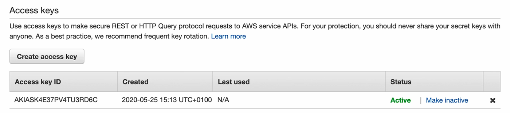
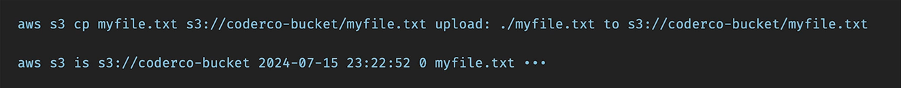
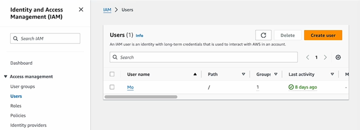
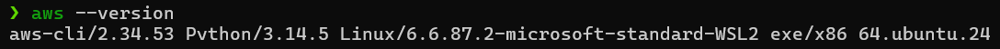
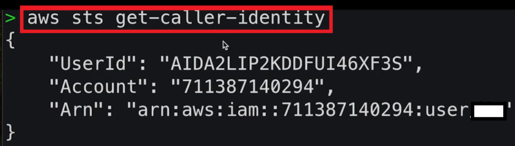
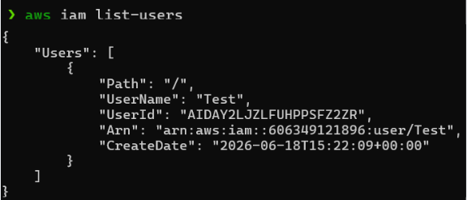

# Access Keys, AWS CLI & AWS SDK

## Overview

This section introduces **AWS Access Keys**, the **AWS Command Line Interface (CLI)**, and the **AWS Software Development Kit (SDK)**. These tools enable users and applications to interact with AWS services programmatically without relying solely on the AWS Management Console.

It focuses on how access keys authenticate requests, how the AWS CLI provides command-line access to AWS services, and how SDKs allow developers to integrate AWS functionality directly into applications using programming languages such as Python, JavaScript, Java, and Go.

## Contents

* [Access Keys](#access-keys)
* [AWS CLI](#aws-cli)
* [AWS SDK](#aws-sdk)
* [CLI Installation & Configuration](#cli-installation--configuration)

---

## Access Keys

AWS Access Keys provide programmatic access to AWS services.

An access key consists of two components:

* Access Key ID
* Secret Access Key

The Access Key ID acts similarly to a username, while the Secret Access Key functions like a password.

These credentials are commonly used by:

* AWS CLI
* AWS SDKs
* Automation scripts
* Applications interacting with AWS services

> [!IMPORTANT]
> Access keys should never be shared, committed to source control, or exposed publicly.

### Access Key Example

<p align="center">
  
</p>

If an access key becomes compromised:

* Disable the key immediately
* Create a replacement key
* Rotate credentials regularly

---

## AWS CLI

The AWS Command Line Interface (CLI) is a tool that allows users to interact with AWS services directly from a terminal.

Instead of performing tasks through the AWS Management Console (ClickOps), commands can be executed programmatically from the command line.

Common AWS CLI use cases include:

* Managing S3 buckets
* Launching EC2 instances
* Creating IAM users
* Automating repetitive tasks
* Building deployment scripts

### Example AWS CLI Commands

<p align="center">
  
</p>

The CLI communicates directly with AWS APIs and is often preferred when automation and repeatability are required.

### ClickOps vs CLI

**ClickOps**

* Manual configuration through the AWS Console
* Useful for learning and quick testing
* Slower for repetitive tasks

<p align="center">
  
</p>

**CLI**

* Command-line driven
* Faster for administration tasks
* Supports scripting and automation
* Preferred in DevOps workflows

> [!NOTE]
> Everything performed through the AWS Console can also be performed through the AWS CLI.

---

## AWS SDK

The AWS Software Development Kit (SDK) enables developers to interact with AWS services directly from application code.

SDKs provide language-specific libraries that simplify communication with AWS APIs.

Supported languages include:

* Python (Boto3)
* JavaScript
* Java
* Go
* C#
* PHP
* Ruby
* C++

### Common SDK Use Cases

* Uploading files to S3
* Creating AWS resources programmatically
* Reading data from AWS services
* Integrating cloud services into applications

Unlike the CLI, which is used by administrators and engineers from a terminal, SDKs are embedded directly within application code.

> [!NOTE]
> The AWS CLI itself is built on top of the AWS SDK for Python (Boto3).

---

## CLI Installation & Configuration

### Installing AWS CLI

AWS provides installation packages for:

* Windows
* macOS
* Linux

Official installation guide:

https://docs.aws.amazon.com/cli/latest/userguide/getting-started-install.html

### Installation Walkthrough

https://github.com/user-attachments/assets/12bff37f-653e-4a89-be62-85dd2b0e341e

After installation, verify the CLI is installed successfully:

```bash
aws --version
```

<p align="center">
  
</p>

---

## Creating Access Keys

To use the CLI, an IAM user requires an access key.

Navigate to:

**IAM → Users → Select User → Security Credentials → Create Access Key**

<p align="center">
  
</p>

---

## Configuring AWS CLI

Configure the CLI using:

```bash
aws configure
```

### Configuration Walkthrough

https://github.com/user-attachments/assets/0f18ec3c-f529-40e9-9679-db1ae21f9790

AWS prompts for:

* Access Key ID
* Secret Access Key
* Default Region
* Output Format

Example:

```text
AWS Access Key ID:
AWS Secret Access Key:
Default region name: eu-west-2
Default output format: json
```

---

## Verifying Authentication

The following command confirms which AWS identity is currently authenticated:

```bash
aws sts get-caller-identity
```

<p align="center">
  
</p>

The response displays:

* User ID
* AWS Account ID
* ARN

---

## Listing IAM Users

The CLI can be used to retrieve IAM users:

```bash
aws iam list-users
```

<p align="center">
  
</p>

Equivalent AWS Console view:

<p align="center">
  
</p>

This demonstrates how CLI commands and Console actions interact with the same AWS resources.

---

## Key Takeaways

* Access keys enable programmatic access to AWS services
* Access Key IDs function similarly to usernames
* Secret Access Keys function similarly to passwords
* Access keys should never be shared or committed to repositories
* AWS CLI provides command-line access to AWS services
* CLI supports automation and scripting
* AWS SDKs allow applications to interact with AWS services programmatically
* SDKs support multiple programming languages
* AWS CLI is built on top of the AWS SDK for Python (Boto3)
* CLI and Console actions ultimately interact with the same AWS APIs

---

## Reflection

Learning about Access Keys, the AWS CLI, and AWS SDKs helped me understand how AWS resources can be managed beyond the Management Console. While ClickOps is useful for learning and exploration, the CLI provides a faster and more scalable approach to administration and automation.

I also learned how access keys authenticate programmatic requests and why protecting credentials is critical. Understanding the relationship between Access Keys, CLI tools, SDKs, and AWS APIs provided a clearer picture of how engineers and applications interact with AWS services in real-world environments.
