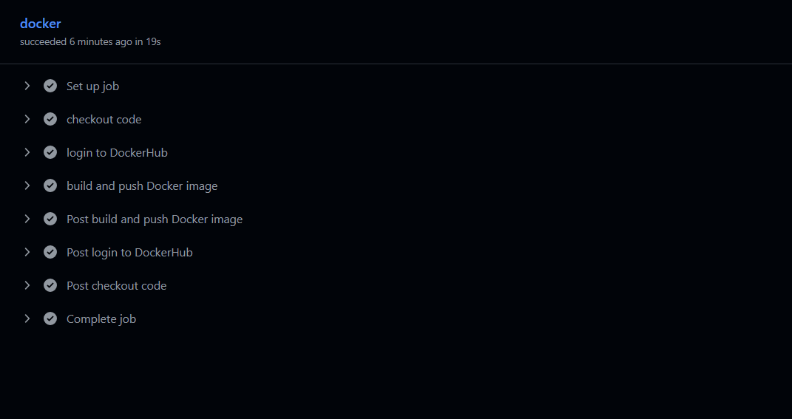
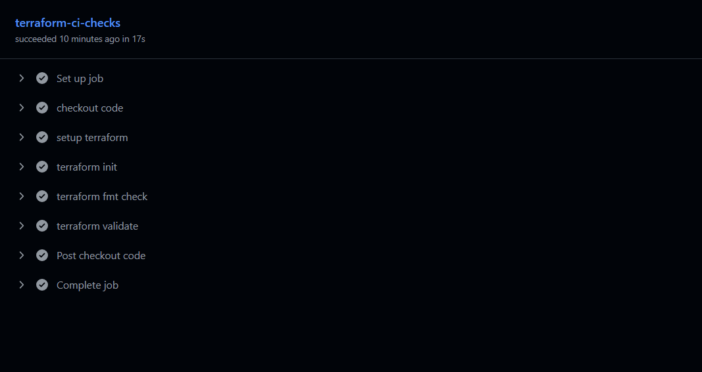

  

# CI/CD Assignments

This repository documents my hands-on CI/CD assignments exploring pipeline automation, GitHub Actions, and software delivery workflows.

Each assignment focuses on building practical CI/CD solutions through automated testing, build processes, deployment workflows, troubleshooting, production-style environments, industry-standard DevOps practices, scalable automation, and reliability.

The focus of this repository is understanding how CI/CD integrates with GitHub Actions to automate testing, validation, and deployment.

---

## Learning Objectives

By working through these assignments, I aim to:

- Apply CI/CD principles to practical development workflows
- Automate testing and validation of code changes
- Build structured pipelines using GitHub Actions
- Trigger automated workflows from repository events
- Automate application builds and deployments
- Develop confidence building production-style CI/CD workflows

---

## Assignments

### **[Assignment 1 - Docker Build and Push Pipeline](./docker-build-push/README.md)**

Built a CI/CD pipeline using GitHub Actions to automatically build and publish Docker images to Docker Hub.
Implemented automated image builds, tagging, and secure publishing using credentials managed through GitHub Actions secrets.
Built through hands-on CI/CD automation, Docker workflows, artefact publishing, and DevOps delivery practices.

 

  

 

  <a href="./docker-build-push/README.md"><strong>➡️ View Project</strong></a>

---

### **[Assignment 2 - Terraform Validation Pipeline](./terraform-checks/README.md)**

Built a Continuous Integration pipeline using GitHub Actions to automatically validate Terraform configuration before infrastructure changes.
Implemented automated formatting and validation checks to ensure consistent, correct Terraform code without deploying resources.
Built through hands-on Terraform automation, CI workflows, Infrastructure as Code validation, and DevOps engineering practices.

 

  

 

  <a href="./terraform-checks/README.md"><strong>➡️ View Project</strong></a>

---

## Resources

- [GitHub Actions Documentation](https://docs.github.com/en/actions)
- [GitHub Actions Workflow Syntax](https://docs.github.com/en/actions/reference/workflows-and-actions/workflow-syntax)
- [GitHub Actions Marketplace](https://github.com/marketplace?type=actions)
- [GitHub Actions Security](https://docs.github.com/en/actions/security-for-github-actions)
- [YAML Documentation](https://yaml.org/)
